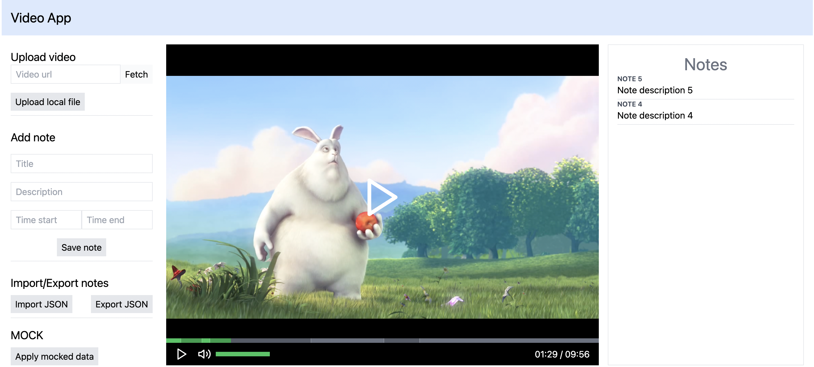

## Description

The Video Player app with custom controls. Also, this app has the ability to add and view notes on specified time intervals.

### Functionality:
- Uploading video from local files
- Uploading video by url
- Adding new notes with title, description, and range(time start in seconds, time end in seconds)
- Exporting notes to JSON file
- Importing notes from JSON file
- Viewing notes in real time when video playback is in the specified range(time start, time end)
- Applying mocked video and notes

### Tech Stack:
- React JS
- Next JS
- Typescript
- TailwindCSS

### Requirements:
`Node.js 14.6.0 or newer`

### How to start:
1. `npm install` or `yarn`
2. `npm run dev` or `yarn dev`

### Screenshot
